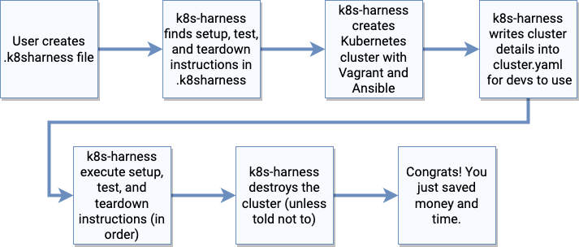

# k8s-harness

🚀 Test your apps in disposable, prod-like Kubernetes clusters 🚀

[[ _insert gif here when ready_ ]]

## But why?

`k8s-harness` is for you if:

- You have apps that run on Kubernetes in production (GKE, EKS, AKS, Rancher, etc.), but
- you don't want to create (and pay for) Kubernetes clusters yourself, and
- you want a prod-like Kubernetes experience on your laptop without the hassles, and
- you just want to run your tests in a clean cluster every time.

`k8s-harness` is probably not for you if:

- You want to learn how Kubernetes works under the hood (check out Hightower's
  [kubernetes-the-hard-way](https://github.com/kelseyhightower/kubernetes-the-hard-way)
  for that), or
- you want to run long-lived clusters on your laptop that you manage.

## How it works



`k8s-harness` is simple:

1. [Create](#.k8sharness) a new `.k8sharness` file.
2. Run your tests! `k8s-harness run`

`run` can take a long time depending on your network connection. If you want to see more
details behind what's going on, enable debug output like this:

```sh
$: k8s-harness --debug run
```

or this:

```sh
$: LOG_LEVEL=debug k8s-harness run
```

### The nitty-gritty

Here's how it really works:

1. `k8s-harness` will look for a `.k8sharness` file in the root of your repository,
2. Once found, it will create a two-node [k3s](https://github.com/rancher/k3s) cluster
   on your machine with [Vagrant](https://vagrantup.com) and [Ansible](https://ansible.io),
3. `k8s-harness` will also provision a local insecure Docker registry into which you can push
   your app's Docker images,
4. `k8s-harness` will run your tests as defined by `.k8sharness` in a Bash subshell,
5. `k8s-harness` destroys the cluster (unless you keep it up with `--disable-teardown`).

(If you're interested in the nitty-gritty of how `k8s-harness` works, check out
[its tests](https://github.com/carlosonunez/k8s-harness/blob/master/tests) for the details.)

## .k8sharness

`k8s-harness` uses `.k8sharness` files to determine what it should do once its cluster is
provisioned. An example file is provided at [`.k8sharness.example`](./.k8sharness.example),
but the crux of how it works is this:

Define your test like this:

```yaml
test: make test
```

You can optionally add setup or teardown instructions too:


```yaml
test: make test
setup: helm install -f testenv.yaml
teardown: make report
```

Every command in `test`, `setup`, and `teardown` runs in a `sh` subshell, but you can
provide a script as well:

```yaml
test: make test
setup: helm install -f testenv.yaml
teardown: ./scripts/run_teardown.sh
```

If you need to have more control over the subshell, just start your test command with
`sh -c`:

```yaml
test: make test
setup: helm install -f testenv.yaml
teardown: sh -xc "echo 'I\'m gonna wreck it!'"
```

## Installing

- `gem install k8s-harness` if you're installing this standalone, or
- Include `k8s-harness` into your app's `Gemfile` if you're building a Ruby or Rails app.

## Options

* See [`.k8sharness.example`](https://github.com/carlosonunez/k8s-harness/blob/master/.k8sharness.example)
  for documentation on how to configure your `.k8sharness` file.
* Run `k8s-harness --help` to learn how to configure `k8s-harness` to your liking.

## Questions

### Does this replace Docker Compose?

Nope! Docker Compose is excellent for locally running your apps and testing that your app
works in Docker. However, I've found Compose to be lacking for testing whether my app can run
with Kubernete's extra features, like `Secret`s and `Ingress` objects. As well, for writing
Ansible playbooks that provision "hard" Kuberntes infrastructure like installing CRDs, I've found
having clean Kubernetes clusters that resemble what I'm provisioning in production to be fast
(or at least faster than waiting for CI/CD to apply my manifests) and cost-effective (since
I don't need to provision my own Kubernetes clusters externally).

### My production Kubernetes clusters has `$x`. How do I install `$x` in k8s-harness?

This is not supported yet, but is on the roadmap!

## Contributing!

Thanks for helping make `k8s-harness` better!

Contributing is simple.

### What You'll Need To Install

- Vagrant
- Virtualbox
- Ansible

### How to contribute

1. Fork this repository.
2. Add a test in `tests/`.

   **NOTE**: If you're adding a new feature to `k8s-harness`, you'll also need to add
   an integration test in `tests/integration` to describe what the feature does, how users
   should use it, and what they can expect when it runs.
   See [the integration test for `run`](./tests/integration/run_spec.rb) for an example.

3. Add your code in `lib`.
4. Run your unit tests: `make unit`
5. Run the integration test to ensure that everything works: `make integration`
6. Push your commits up to your fork, then submit a new pull request into this repo!

### A note about pushing new gems

You're free to fork this and create your own gems from a forked instance of this codebase. Note
that the CD that's included in the [`.github`](./.github) directory requires that you
define `GEM_HOST_API_KEY` in your build.
